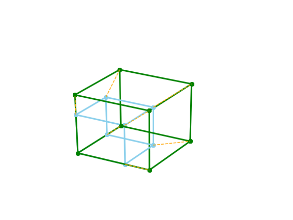
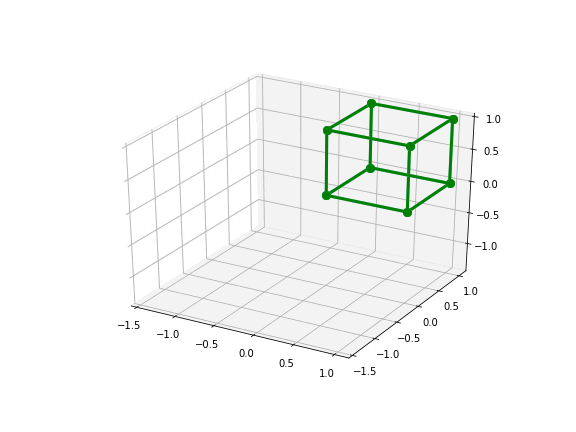
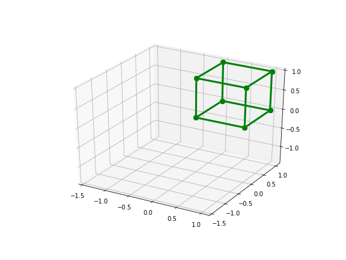
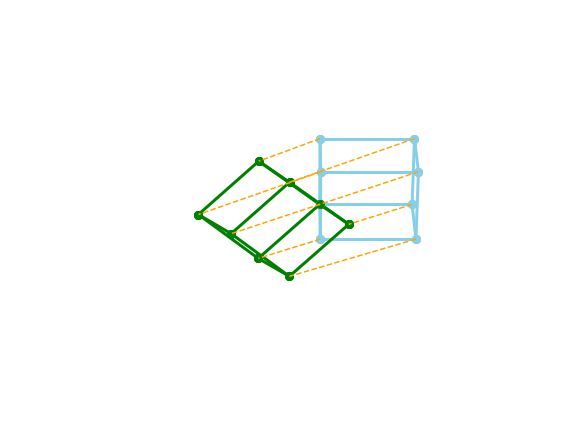

# Affine Transformation Visualization

A notebook for creating 3D gifs of affine transformations. See [TransformatonVisualization.ipynb](TransformatonVisualization.ipynb) for code. 

## Examples:

### Translation

### Scaling

### Rotation

### Projection to a plane

### Projection then Mirror

### Mirror (with spin)

